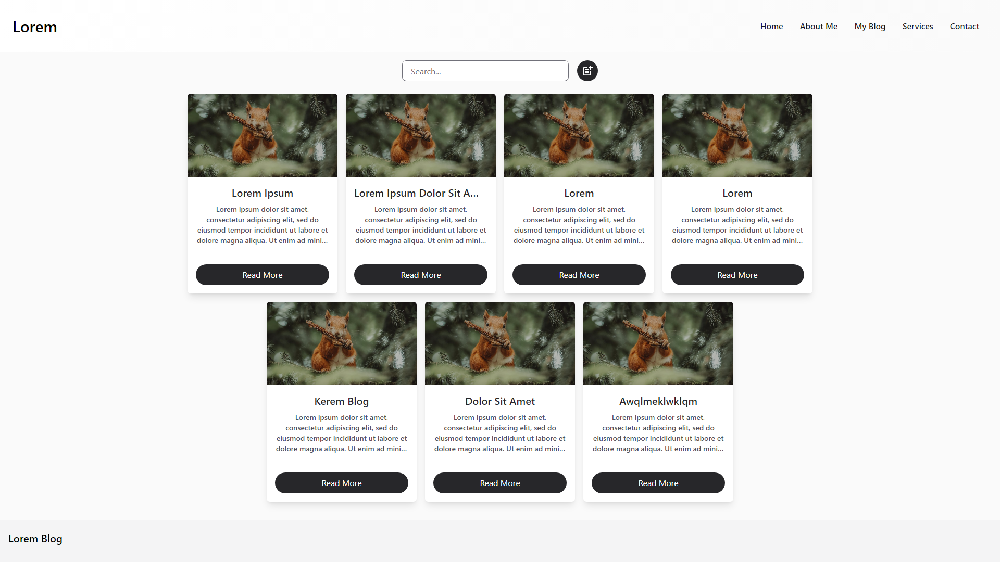
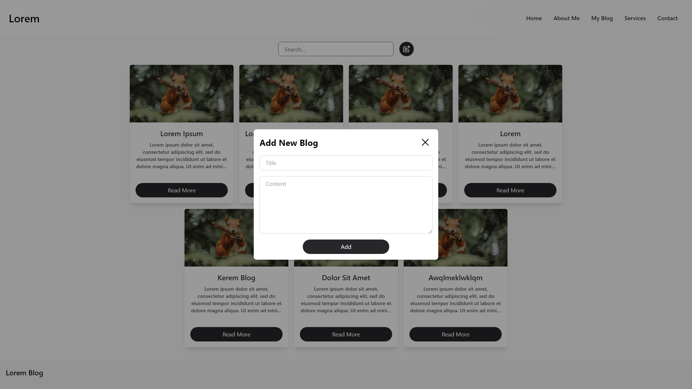
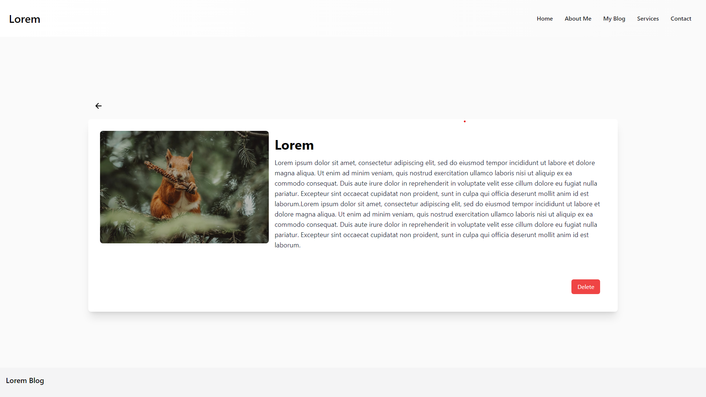

## Running Locally

### Cloning the repository the local machine.

```bash
git clone
```

### Installing the dependencies.

```bash
npm install
```
### Running the application.

Then, run the application in the command line and it will be available at `http://localhost:3000`.

```bash
npm start
```
### Running the Json-Server.

Then, run the json-server in the command line and it will be available at `http://localhost:8000`.

```bash
npm start-server
```




